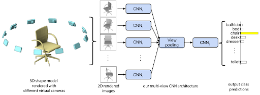

# 3D_multiviewCNN
I have implemented Multi-view CNN for 3D classification using MoodleNet40 dataset.<br\>
The author from original paper uses VGG net, but I used a pre-trained ResNet34 and find tuned by building classifier at the end.<br\>
By doing this, I have achieved over 98% in validation dataset.

